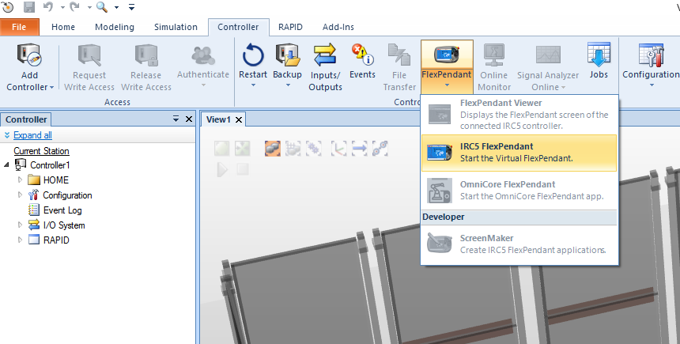

# Project 1: Sorting line in ABB RobotStudio

The aim of this project was to create a sorting line in ABB RobotStudio and simulate it.

## How to use

Open RobotStudio Pack & Go file (.rspag). For the simulation to work properly, you need to run the virtual FlexPendant before running the simulation, which is used to select the color of the object to be sorted. Otherwise the simulation will end with an error.

